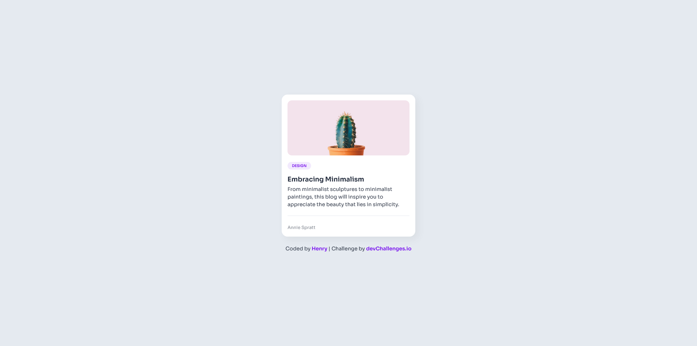

<!-- Please update value in the {}  -->

<h1 align="center">Minimal Blog Card | devChallenges</h1>

   Solution for a challenge <a href="https://devchallenges.io/challenge/minimal-blog-card" target="_blank">Minimal Blog Card</a> from <a href="http://devchallenges.io" target="_blank">devChallenges.io</a>.

  <h3>
    <a href="https://henrydevlab.github.io/minimal-blog-card/">
      Demo
    </a>
     | 
    <a href="https://github.com/Henrydevlab/minimal-blog-card">
      Solution
    </a>
     | 
    <a href="https://devchallenges.io/challenge/minimal-blog-card">
      Challenge
    </a>
  </h3>

<!-- TABLE OF CONTENTS -->

## Table of Contents

- [Overview](#overview)
  - [What I learned](#what-i-learned)
  - [Useful resources](#useful-resources)
- [Built with](#built-with)
- [Features](#features)
- [Contact](#contact)
- [Acknowledgements](#acknowledgements)

<!-- OVERVIEW -->

## Overview

This project is a response to the Minimal Blog Card challenge. The goal was to build a clean, responsive card component that precisely follows a design guide for typography, colors, and spacing. I focused on making the layout fluid across Desktop (1280px), Tablet (1024px), and Mobile (640px) screen sizes.

### What I learned

- **Managing Brand Identity:** Using CSS variables to strictly enforce a specific color palette (#7C19EE, #E5EAF0, etc.) and Sora typography.
- **Blending Techniques:** Using `mix-blend-mode: multiply` on the cactus image to allow the background container color (#FAFAF9) to show through correctly.
- **Precision Layout:** Implementing specific spacing guides (16px, 6px, and 20px gaps) to match the professional design specifications.
- **Semantic Structure:** Using HTML5 `<article>`, `<header>`, and `<footer>` tags to ensure the author and content are properly indexed by screen readers.

### Useful resources

- [Google Fonts - Sora](https://fonts.google.com/specimen/Sora) - Used for all text elements.
- [CSS-Tricks: Mix Blend Mode](https://css-tricks.com/almanac/properties/m/mix-blend-mode/) - Helpful for understanding how to blend the cactus image background.

### Built with

- Semantic HTML5 markup
- CSS custom properties
- Flexbox
- Mobile-first workflow

## Features

- **Two-Tone Backgrounds:** Includes a specific pinkish hue for the image container separate from the page background.
- **Fully Responsive:** Adapts perfectly to Mobile, Tablet, and Desktop breakpoints.
- **Typography Focused:** Implements Sora font with specific weights and sizes for hierarchy.

This application/site was created as a submission to a [DevChallenges](https://devchallenges.io/challenges-dashboard) challenge.

## Author

- GitHub [@henrydevlab](https://{github.com/henrydevlab)
